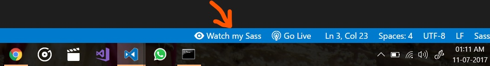

# Layout-task

## Description

Simple layout of the page with header,main section, footer, burger.

## Installation

```sh
Install 'live sass compiler' plagin in your VSCode 
```

- [LiveSassCompiler](https://marketplace.visualstudio.com/items?itemName=ritwickdey.live-sass)

## Running the app

```sh
Click to Watch Sass from Statusbar to turn on the live compilation and then click to Stop Watching Sass from Statusbar to turn on live compilation .
```


